# GENESIS - Kapali Dongu Uzay Tarimi Yasam Destek Sistemi Simulatoru

Mars'ta 6 kisilik bir murettebati 980 gun boyunca hayatta tutabilecek, tamamen kapali dongu biyorejeneratif yasam destek sistemi simulasyonu.

Canli Demo: https://genesis-nu-flame.vercel.app/

---

## Icindekiler

1. Proje Ozeti
2. Bilimsel Temel
3. Teknik Mimari
4. Simulasyon Motorlari (15 Modul)
5. Sayfa ve Bilesenler
6. Durum Yonetimi ve Veri Akisi
7. Bitki Sistemi
8. Senaryo Sistemi
9. 3D Modeller ve Donanim Tasarimi
10. Kullanici Arayuzu Tasarimi
11. Klavye Kisayollari
12. Kurulum ve Calistirma
13. Dosya Yapisi
14. Bagimliliklar
15. Bilimsel Referanslar

---

## 1. Proje Ozeti

GENESIS, uzun sureli Mars gorevleri icin tasarlanmis gercek zamanli bir Kapali Dongu Biyorejeneratif Yasam Destek Sistemi (BLSS) simulatorudur. ESA'nin MELiSSA protokolune dayali olarak hava, su, gida, atik ve enerji donglerini modellemektedir.

### Temel Ozellikler

- 15 simulasyon motoru gercek zamanli olarak calisan bilimsel hesaplamalar
- 180'den fazla sanal sensor sinuzoidal dongeler ve Gauss gurultusu ile
- 8 interaktif sayfa farkli operasyonel alanlar icin
- 3D dijital ikiz Three.js ile gercek zamanli goruntuleme
- Yapay zeka tahmini: anomali tespiti, trend analizi, 30 gunluk projeksiyon
- 6 bitki turu aeroponik sistemde sigmoid buyume modeli ile
- 6 kisilik murettebat, 24 saat vardiya sistemi, metabolik hesaplamalar
- 980 gunluk gorev: transit, yuzey ve donus fazlari
- Tamamiyla Turkce kullanici arayuzu

### Proje Ekran Goruntuleri

| Genel Bakis | Buyume Izleme | Beslenme |
|:-----------:|:-------------:|:--------:|
| 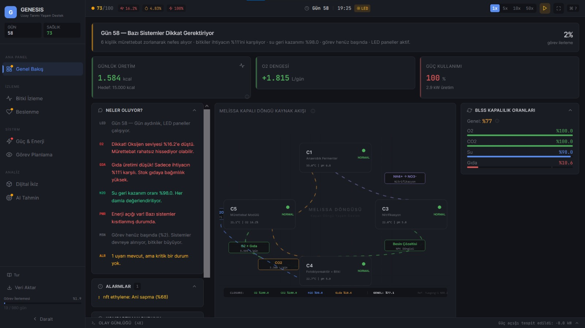 | 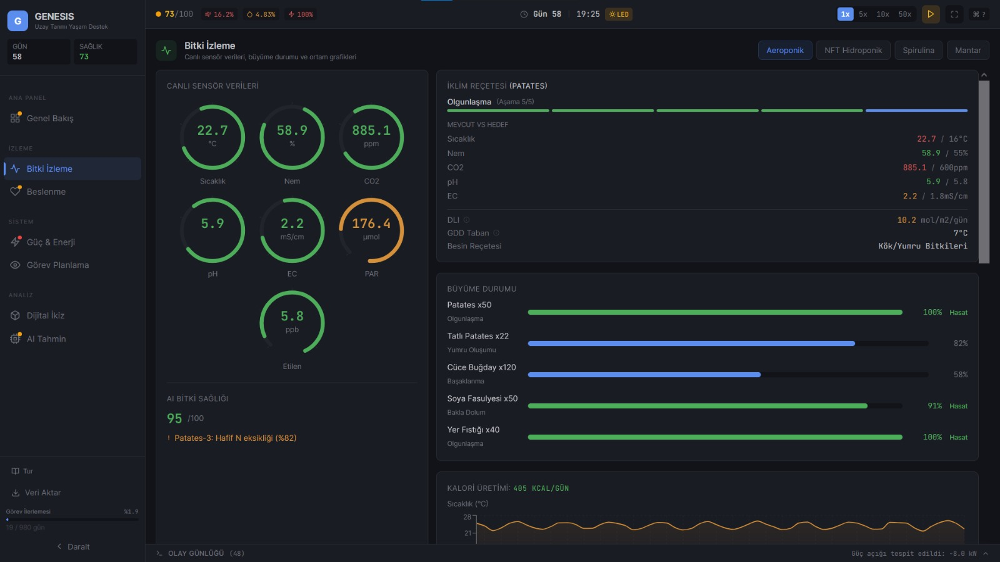 | 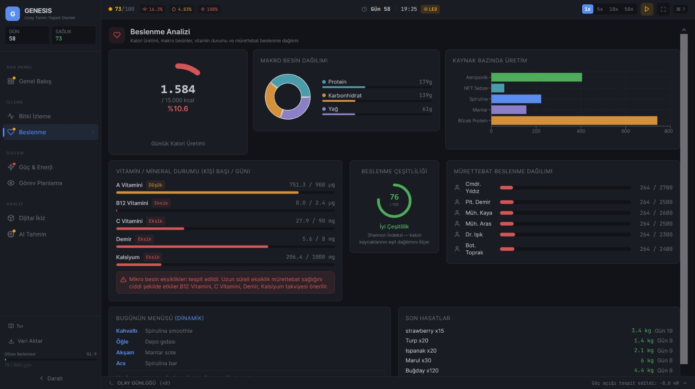 |

| Guc ve Enerji | Gorev Planlama | Dijital Ikiz |
|:-------------:|:--------------:|:------------:|
| 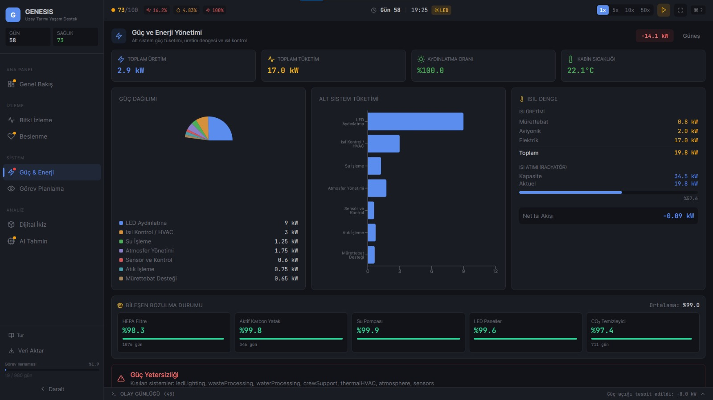 | 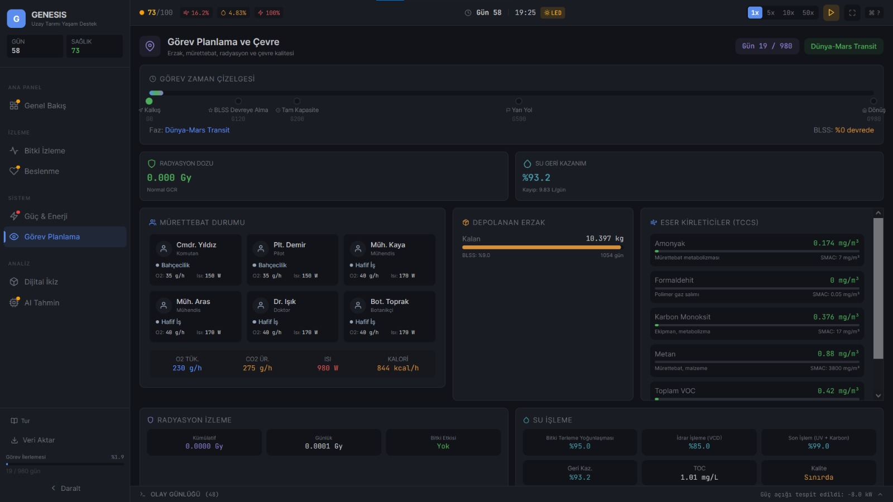 | 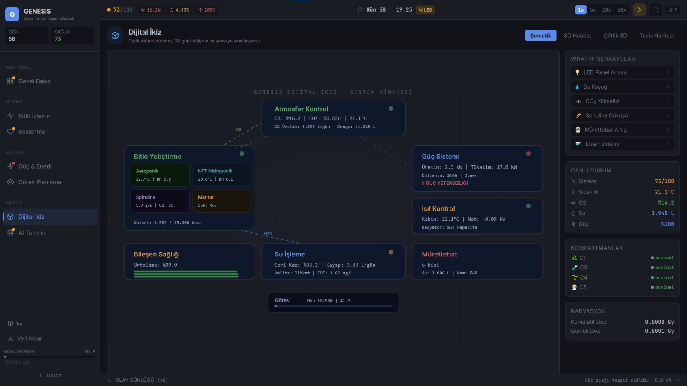 |

| AI Tahmin |
|:---------:|
| 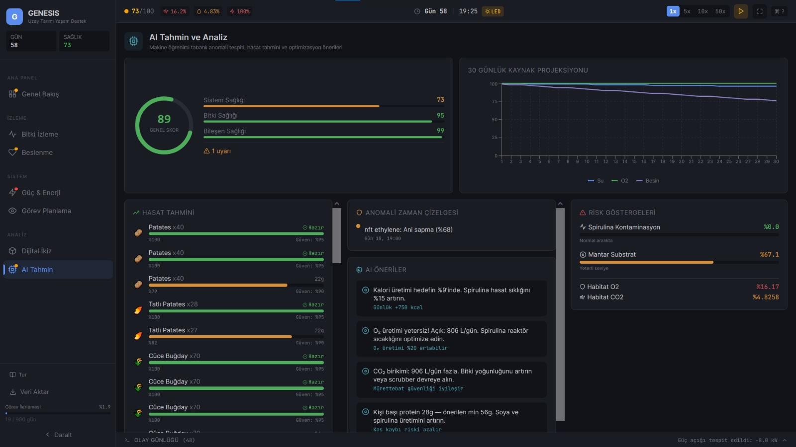 |

---

## 2. Bilimsel Temel

### 2.1 MELiSSA Protokolu (ESA)

Proje, ESA'nin Micro-Ecological Life Support System Alternative (MELiSSA) protokolune dayanmaktadir. 4 kompartimandan olusan kapali dongu sistemi su sekilde calisir:

C5 Habitat (Murettebat, 21 derece, %50 nem) organik atigi C1 Anaerobik Fermenter'e (55 derece, termofilik parcalama) gonderir. C1'den cikan NH4+ ciktisi C3 Nitrifikasyon biriminde (Nitrosomonas / Nitrobacter bakterileri ile) NO3- besin maddesine donusturulur. Bu besinler C4b Fotosentez birimine (aeroponik bitkiler, LED aydinlatma) beslenir. C4b'den uretilen O2 ve gida tekrar Habitat'a doner. Boylece tamamen kapali bir dongu olusur.

| Kompartiman | Sicaklik | pH | Islem |
|-------------|----------|-----|-------|
| C1 - Anaerobik Fermenter | 55 derece | 6.8 | Organik atigin termofilik parcalanmasi |
| C3 - Nitrifikasyon | 28 derece | 7.5 | NH4+ donusumu: once NO2- sonra NO3- |
| C4b - Fotobiyoreaktor | 22 derece | 5.8 | Bitki buyumesi, O2 uretimi, CO2 emilimi |
| C5 - Habitat | 21 derece | - | Murettebat yasam alani, atmosfer kontrolu |

### 2.2 Referans Programlar

| Program | Ulke / Kurum | Kullanim Alani |
|---------|------------|----------------|
| NASA VEGGIE | NASA / ISS | Bitki buyume verileri, marul (Outredgeous) ISS'te yetistirilen ilk bitki (Agustos 2015) |
| NASA APH | NASA / ISS | Gelismis bitki habitati, bugday NDVI 0.85-0.93 |
| BIOS-3 | Rusya | Kapali ekolojik sistem verileri |
| Yuegong-1 | Cin | Su isleme verileri, %98.7 geri kazanim orani |
| Eden ISS | ESA / DLR | Antarktika sera verileri, marul NDVI 0.82-0.90 |
| CELSS | NASA | Bitki verimi referans degerleri (g/m2/gun) |

### 2.3 NASA BVAD Referans Degerleri

Murettebat metabolik hesaplamalari NASA BVAD Rev2'ye dayanir:

| Parametre | Deger | Birim |
|-----------|-------|-------|
| O2 tuketimi | 630 | L/gun/kisi |
| CO2 uretimi | 550 | L/gun/kisi (RQ=0.87) |
| Su ihtiyaci | 3.8 | L/gun/kisi |
| Kalori | 2500 | kcal/gun/kisi |
| Atik | 1.8 | kg/gun/kisi |

---

## 3. Teknik Mimari

### 3.1 Teknoloji Yigini

| Katman | Teknoloji | Surum |
|--------|-----------|-------|
| UI Framework | React | 19.2.4 |
| Build Tool | Vite | 8.0.2 |
| Stil | Tailwind CSS | 3.4.19 |
| 3D Grafik | Three.js | 0.183.2 |
| 3D React | react-three/fiber + drei | 9.5.0 / 10.7.7 |
| Grafik | Recharts | 3.8.0 |
| Ikonlar | React Icons | 5.6.0 |
| Derleme | PostCSS + Autoprefixer | 8.5.8 / 10.4.27 |

### 3.2 Uygulama Yapisi

En ust seviyede App.jsx yer alir. Icinde GenesisProvider (global state yonetimi) bulunur. Bunun altinda ToastProvider (bildirim sistemi) vardir. Uygulama acildiginda once SplashScreen (giris animasyonu), ardindan OnboardingTour (kullanici rehberi) gosterilir. Ana icerik AppLayout icerisindedir.

AppLayout uc parcadan olusur:
- Sidebar: Sol navigasyon menusu (8 sayfa gecisi)
- TopBar: Ust kontrol cubugu (zaman, hiz, saglik skoru)
- PageContent: React.lazy ile tembel yuklenen sayfa icerigi

PageContent icinde 8 sayfa yer alir: OverviewPage, GrowthMonitorPage, NutritionPage, PowerPage, MissionPage, DesignPage, DigitalTwinPage ve AIPredictionPage.

### 3.3 Veri Akis Semasi

useSimulation hook'u her saniye bir tick atar. Her tick'te sirasiyla su islemler yapilir:

1. generateAllSensors() ile 180'den fazla sensor verisi uretilir
2. calculateResourceFlow() ile O2, CO2, su, besin ve kalori dengeleri hesaplanir
3. calculatePowerSystem() ile guc uretim ve tuketim hesaplanir
4. calculateThermalBalance() ile isi yonetimi yapilir
5. calculateCrewMetabolics() ile murettebat metabolizmasi hesaplanir
6. calculateRadiation() ile radyasyon dozaj takibi yapilir
7. calculatePathogenRisk() ile hastalik risk modeli calistirilir
8. calculateDegradation() ile bilesen asinma ve yipranma hesaplanir
9. calculateWaterProcessing() ile su geri kazanimi hesaplanir
10. calculateTraceContaminants() ile hava kalitesi olculur
11. detectAnomalies() ile istatistiksel anomali tespiti yapilir
12. calculateModuleNDVI() ile bitki saglik indeksi hesaplanir
13. calculateMissionStatus() ile gorev durumu guncellenir
14. generateAIInsights() ile yapay zeka onerileri uretilir

Tum bu hesaplamalarin sonuclari dispatch(UPDATE_*) aksiyonlari ile GenesisContext Reducer'a gonderilir. React bilesenleri bu context'ten okuyarak kendilerini gunceller.

### 3.4 Zaman Olcegi

| Gercek Zaman | Simulasyon Zamani | Aciklama |
|--------------|-------------------|----------|
| 1 saniye | 5 dakika | 1 tick |
| 12 saniye | 1 saat | 12 tick |
| 288 saniye (yaklasik 5 dakika) | 1 gun | 288 tick |

| Hiz Carpani | Etki |
|-------------|------|
| 1x | 5 dk/tick - Normal |
| 5x | 25 dk/tick - Hizli |
| 10x | 50 dk/tick - Cok hizli |
| 50x | 250 dk/tick - Ultra hizli |

---

## 4. Simulasyon Motorlari (15 Modul)

### 4.1 Sabitler Veritabani (constants.js, yaklasik 938 satir)

Tum bilimsel referans degerleri tek bir dosyada merkezlestirilmistir:

- LED_SPECTRUM: NASA VEGGIE/APH referansli isik spektrumu (%50 kirmizi, %25 mavi, %5 yesil, %10 uzak kirmizi, %10 beyaz)
- PHOTOPERIOD: 16 saat isik dongusu (06:00-22:00), 1 saat rampa fazlari
- PLANTS: 8 bitki turu detayli bilgileriyle (tatlı patates, yer fistigi, soya, marul, fesligen, nane, kekik, ispanak)
- CREW: NASA BVAD metabolik verileri (O2, CO2, su, kalori, atik)
- LIMITS: Kritik esik degerleri (O2 %19.5-23.5, CO2 %0.02-0.5, sicaklik 18-30 derece, nem %30-80, pH 5-7, EC 0.5-4 mS/cm, PAR 100-1000 umol/m2/s)
- MODULE_AREAS: 47 m2 toplam dikey ciftlik (3 kat x 15.7 m2)
- SCENARIOS: 5 what-if senaryosu
- COMPARTMENTS: 4 MELiSSA kompartimani
- NUTRIENT_RECIPES: Hoagland bazli besin recetesi (yaprak, kok, aromatik kategorileri)
- VITAMINS: 10 mikro besin ogesi veritabani (A, C, K, folat, demir, kalsiyum, magnezyum, potasyum vb.)
- POWER: Gunes ve nukleer enerji, 7 alt sistem tuketim verileri
- THERMAL: Stefan-Boltzmann radyator modeli parametreleri
- DEGRADATION: 5 bilesen yipranma modeli (HEPA, karbon yatak, pompa, LED, scrubber)
- PATHOGENS: 3 hastalik turu (kul hastaligi, kok curumesi, kuf)
- RADIATION: GCR ve SPE modeli
- MISSION: 3 fazli gorev (transit-yuzey-donus, toplam 980 gun)

### 4.2 Bitki Buyume Modeli (plantGrowthModel.js)

Sigmoid buyume egrisi ile cevre faktorlerinin carpimsal etkisi kullanilir.

Verim hesabi: Verim = VerimMax bolgesinde sigmoid fonksiyon (s-egrisi) ile belirlenir ve cevre carpani ile carpilir. Sigmoid egri, buyume gunlerinin ortasinda en hizli buyumeyi, baslangic ve sonda ise yavas buyumeyi modellemektedir.

Cevre carpanlari ve agirliklari:

| Faktor | Agirlik | Hesaplama |
|--------|---------|-----------|
| Sicaklik | %25 | Gauss faktoru, optimal sicaklik merkezli |
| PAR (Isik) | %15 | PAR / 400, maksimum 1.2 |
| DLI (Gunluk Isik) | %15 | Ture ozel min/max/optimal olcekleme |
| Su | %10 | Mevcut ise 1.0, yetersiz ise 0.3 |
| CO2 | %15 | Logaritmik-lineer, maksimum 1.3 |
| Recete Uyumu | %10 | Gauss (sicaklik/nem/CO2 hedef uyumu) |
| Cozunmus O2 | %10 | Kok oksijenasyonu faktoru |

Ek hesaplamalar:
- GDD (Buyume Derece Gunleri): Ortalama sicakligin baz sicakligin ustundeki kisminin toplami
- DLI (Gunluk Isik Integrali): PPFD degerinin fotoperiyot suresiyle carpimindan elde edilir
- Cozunmus Oksijen: Sicakliga bagli doyma denklemiyle hesaplanir
- Pythium Riski: Cozunmus oksijen 4 mg/L'nin altina dustugunde ustel olarak artar

### 4.3 Kaynak Akis Motoru (resourceFlowEngine.js)

8 adimli kutle ve enerji dengesi hesaplamasi yapar:

1. Murettebat tuketimi: O2, CO2, su, atik miktarlari
2. Aeroponik uretim: kalori ve makro besinler
3. NFT uretim: yaprak sebzeler
4. Ceza uygulama: patojen ve radyasyon kayiplarinin carpimi
5. Gaz dengesi: O2 uretim vs tuketim, CO2 emilim vs uretim
6. Su dongusu: %98 hedef geri kazanim orani
7. Besin geri donusumu: atik parcalama ve nitrifikasyon sureci
8. Kalori dengesi: uretim vs 2500 kcal/gun hedef

Kapatma oranlari (closure) MELiSSA metrigi olarak hesaplanir:

| Kaynak | Hesaplama | Hedef |
|--------|-----------|-------|
| O2 | uretim / tuketim x 100 | %100 |
| CO2 | emilim / uretim x 100 | %100 |
| Su | geri kazanim orani x 100 | %98.7 |
| Gida | uretim / (murettebat x 2500) x 100 | %100 |
| Malzeme | yukaridakilerin agirlikli ortalamasi | %100 |

Saglik skoru (0-100) su cezalarla hesaplanir: O2 acigi maksimum -30 puan, CO2 birikimi -20 puan, kalori yetersizligi -30 puan, su kaybi -(0.98 - geriKazanim) x 100.

Biyocesitlilik skoru Shannon cesitlilik indeksi ile hesaplanir. Ne kadar cesitli ve dengeli bitki uretimi varsa skor o kadar yuksek olur.

### 4.4 Sensor Simulatoru (sensorSimulator.js)

180'den fazla sanal sensor her tick'te guncellenir. Her sensor degeri su bilesenlerden olusur:

- Baz deger (sensorun temel degeri)
- Gunluk dongu (sinuzoidal salınim, gun/gece farki)
- Gauss gurultusu (Box-Muller yontemiyle rastgele sapma)
- Uzun vadeli trend (yavos degisen kayma)

Ozel durumlar: PAR ve isinlanma sensorleri isik saatleri (06:00-22:00) disinda sifir deger verir. Senaryo aktifse ek carpan uygulanir.

Her sensor "nominal", "warning" veya "critical" durumlarından birine sahiptir.

### 4.5 Anomali Dedektoru (anomalyDetector.js)

4 katmanli tespit sistemi:

1. Limit Ihlali: Kritik veya uyari esiklerini asma kontrolu
2. Ani Degisim (Spike): 3-sigma kurali ile son pencere uzerinde istatistiksel sapma tespiti
3. Degisim Hizi: %30'un uzerinde goreceli degisim algilama
4. Tahmine Dayali Uyari: 6 saat ilerisine lineer ekstrapolasyon yaparak olasi limit asimi tahmini

Yapay zeka onerileri uretir: kalori optimizasyonu, pH ayarlama, ardisik ekim zamanlama, O2/CO2 denge duzeltmeleri, su geri kazanim iyilestirme, protein yeterliligi, trend bazli uyarilar.

### 4.6 Guc Sistemi (powerSystem.js)

Uretim kaynaklari:

| Kaynak | Kapasite | Detay |
|--------|----------|-------|
| Gunes Paneli | 12 kW | %30 verim, 80 m2, %2/yil bozulma |
| Nukleer (Kilopower) | 20 kW | 2 adet 10 kW reaktor |

Konum bazli gunes isigi yogunlugu:

| Konum | W/m2 |
|-------|------|
| LEO (ISS) | 155 |
| Ay Ekvator | 70 |
| Ay Kutup | 200 |
| Mars Yuzey | 52 |

7 alt sistem tuketimi:

| Alt Sistem | Baz Guc | Oncelik | Dinamik Faktor |
|------------|---------|---------|----------------|
| LED Aydinlatma | 14 kW | 3 (dusuk) | Isik dongusu, LED sagligi |
| HVAC (Termal) | 4 kW | 1 (yuksek) | Sicaklik farki, murettebat isisi |
| Su Isleme | 1.5 kW | 2 (orta) | TOC seviyesi, hacim |
| Atmosfer | 1.5 kW | 1 (yuksek) | CO2 seviyesi, scrubber sagligi |
| Atik Isleme | 0.5 kW | 2 (orta) | Parcalama orani |
| Murettebat | 0.3 kW | 2 (orta) | Metabolik aktivite |
| Sensorler | 0.8 kW | 3 (dusuk) | Modul sayisi |

Guc acigi durumunda dusuk oncelikli sistemler (LED, sensorler) %50 kisitlanir.

### 4.7 Termal Sistem (thermalSystem.js)

Stefan-Boltzmann radyator modeli kullanilir. Radyator parametreleri: emisivite 0.88, alan 25 m2, radyator sicakligi 300K, cukur sicakligi 220K (Mars ortami).

Isi kaynaklari:
- Murettebat: kisi basina 80-500 W (uyku ile agir egzersiz arasinda degisir)
- Aviyonik: 2.0 kW sabit
- Elektrik: tum guc tuketimi sonunda isiya donusur

Kabin termal kitlesi 50.000 J/K olarak modellenmistir. Hedef sicaklik 22 derece, guvenli aralik 15-30 derecedir.

### 4.8 Su Isleme (waterProcessing.js)

Yuegong-1 referansli cok asamali su geri kazanimi:

| Asama | Verimlilik | Pay | Yontem |
|-------|------------|-----|--------|
| Kondensat | %95 | %75 | Bitki terleme yogunlastirmasi |
| Idrar | %85 | %20 | Buhar sikistirma distilasyonu (VCD) |
| Cilalama | %99 | %5 | UV + aktif karbon |

Su kalitesi TOC (Toplam Organik Karbon) ile olculur:
- Icime uygun: TOC 0.5 mg/L'nin altinda
- Sinirda: 0.5 - 2 mg/L
- Kirli: 2 mg/L'nin uzerinde

### 4.9 Bozulma Modeli (degradationModel.js)

5 bilesen icin farkli asinma egrileri:

| Bilesen | Omur | Model | Ozellik |
|---------|------|-------|---------|
| HEPA Filtre | 3 yil | Lineer | Basinc dususu zamanla nonlineer artar |
| Karbon Yatak | 1 yil | Sigmoid | Omrun %70'inde hizli dusus baslar |
| Su Pompasi | 15.000 saat | Weibull (beta=2) | Minimum %50 kapasite korunur |
| LED Panel | 35.000 saat | Ustel azalma | Uzay radyasyonu %25 ek kayip olusturur |
| CO2 Scrubber | 2 yil | Lineer | Sabit saglik azalimi |

### 4.10 NDVI Modeli (ndviModel.js)

Normalize Edilmis Fark Vejetasyon Indeksi ile bitki sagligi olculur. Sigmoid egri ile cimlenmede 0.18'den baslayip olgun bitkide 0.92'ye ulasir. Donusun hizli noktasi buyume ilerlemesinin %35'indedir.

Stres faktorleri carpimsal olarak etkiler:
- Sicaklik: optimalden 10 dereceden fazla sapma durumunda 0.65 carpani
- Isik (sadece gunduz): 100 umol'un altinda 0.75 carpani
- CO2: 300 ppm'in altinda 0.8 carpani

Durum siniflandirmasi: saglikli (0.70 ve ustu), uyari (0.50-0.70), kritik (0.50'nin altinda).

### 4.11 Patojen Modeli (pathogenModel.js)

Cok durumlu hastalik ilerlemesi modellenir: Saglikli durumdan kulucka doneminde (2-5 gun) enfekte, sonra semptomatik ve agir durumlara gecis olur. Tedavi ve uygun kosullar saglanirsa iyilesme yolu vardir.

3 hastalik turu:

| Hastalik | Optimal Kosul | Yayilma Hizi | Verim Kaybi | Tespit Suresi |
|----------|---------------|--------------|-------------|---------------|
| Kul Hastaligi | 24 derece / %70 nem | %5/gun | %30 | 3 gun |
| Kok Curumesi (Pythium) | 26 derece / %95 nem + dusuk DO | %3/gun | %50 | 5 gun |
| Kuf (ISS Veg-03 ref.) | 22 derece / %85 nem | %7/gun | %40 | 2 gun |

Tedavi etkileri: tedavi uygulamasi yayilmayi %70 azaltir, karantina %50 azaltir. Moduller arasi capraz bulasma hava sirkulasyonu ile cok dusuk olasilikla gerceklesebilir.

### 4.12 Radyasyon Modeli (radiationModel.js)

GCR (Galaktik Kozmik Isinlar) kronik etkisi: serbest uzayda 0.0005 Gy/gun, Mars yuzeyinde %50 koruma ile 0.0002 Gy/gun.

SPE (Gunes Parcacik Olaylari) akut etkisi: gunluk %0.3 olasilik (yilda yaklasik 1 olay), olay basina 0.05-0.5 Gy doz, 2 gun sure. 0.2 Gy'nin altinda minor, ustunde major olay siniflandirmasi.

Bitki hassasiyeti: kok bitkileri (tatli patates) 0.6, yaprak (marul, ispanak) 0.3, tohumlar cok toleransli.

### 4.13 Gorev Planlayici (missionPlanner.js)

| Faz | Sure | BLSS Durumu | Aciklama |
|-----|------|-------------|----------|
| Transit 1 | 240 gun | Pasif | Dunya'dan Mars'a yolculuk |
| Yuzey | 500 gun | Aktif | Mars yuzey operasyonlari |
| Transit 2 | 240 gun | Pasif | Mars'tan Dunya'ya donus |
| Toplam | 980 gun | | |

Gida yonetimi: Depolanmis gida kisi basina 1.8 kg/gun tuketilir. BLSS sistemi 30. gunden itibaren devreye girmeye baslar ve 120 gunde tam kapasiteye ulasir. BLSS katkisi %80'i astiginda crossover noktasina ulasilir ve depolanmis gidaya bagimlilik buyuk olcude azalir.

Alan yeterliligi: toplam 47 m2 dikey ciftlik, kisi basina hedef 8 m2'dir.

### 4.14 Murettebat Aktivite Modeli (crewActivityModel.js)

24 saatlik varsayilan program:

| Saat | Aktivite | O2 (L/dk) | Isi (W) | kcal/saat |
|------|----------|-----------|---------|-----------|
| 22-06 | Uyku | 0.25 | 80 | 60 |
| 06-07 | Yemek | 0.35 | 120 | 90 |
| 07-09 | Egzersiz | 1.50 | 500 | 400 |
| 09-13 | Calisma | 0.50 | 150 | 120 |
| 13-14 | Yemek | 0.35 | 120 | 90 |
| 14-16 | Sera Bakimi | 0.60 | 180 | 150 |
| 16-20 | Calisma | 0.50 | 150 | 120 |
| 20-22 | Dinlenme | 0.30 | 100 | 70 |

Coklu murettebat icin 4 saatlik faz kaydirilmis vardiya sistemi uygulanir, boylece 24 saat kesintisiz operasyon saglanir.

### 4.15 Iz Kirleticiler (traceContaminants.js)

ISS TCCS (Trace Contaminant Control Subassembly) referansli hava kalitesi izleme:

| Kirletici | SMAC-180 Limiti | Gunluk Uretim | Scrubber Verimi | Kaynak |
|-----------|-----------------|---------------|-----------------|--------|
| Amonyak | 7.0 mg/m3 | 0.05 | %90 | Murettebat metabolizması |
| Formaldehit | 0.05 mg/m3 | 0.002 | %95 | Polimer gaz cikisi |
| CO | 17.0 mg/m3 | 0.083 | %95 | Ekipman + metabolizma |
| Metan | 3800 mg/m3 | 0.167 | %80 | Murettebat + malzeme |
| VOC (toplam) | 25.0 mg/m3 | 0.083 | %85 | Yapistiriclar, contalar |

Her kirletici icin SMAC orani (seviye / limit) hesaplanir. Oran %70'in uzerindeyse uyari, %100'un uzerindeyse kritik alarm verilir.

---

## 5. Sayfa ve Bilesenler

### 5.1 Genel Bakis Sayfasi (OverviewPage)

Ana gosterge paneli olarak sistemin genel durumunu ozetler:

- Anlatici Kahraman: Murettebat durumu, bitki verimliligi, su geri kazanimi ve gorev ilerlemesi hakkinda dinamik metin ozeti
- Anahtar Metrikler: 3 sutunlu kartlar ile gunluk kalori uretimi, O2 dengesi, guc kullanimi
- Uyari Paneli: Renk kodlu anomali ve kritik uyarilarin listesi
- Kompartiman Durumu Tablosu: Atik, besin, buyume ve habitat alt sistemlerinin durumu
- Kapatma Oranlari: O2, CO2, su ve gida icin animasyonlu ilerleme cubuklari
- Kapali Dongu Diyagrami: SVG animasyonlu MELiSSA dongusu gorsellestirmesi, 4 kompartiman arasindaki malzeme akislari animasyonlu cizgilerle gosterilir
- Donanim Galerisi: React-Three-Fiber ile 3D GLB model goruntuleyici, surukle-dondur ve scroll-yakinlastir destegi

### 5.2 Buyume Izleme Sayfasi (GrowthMonitorPage)

Canli bitki sensor verileri ve buyume takibi:

- Modul Sekmeleri: Aeroponik ve Aeroponik Yaprak (NFT) arasinda gecis
- 8 Dairesel Sensor Gostergesi: sicaklik, nem, CO2, pH, EC, PAR, yogunluk, etilen
- Buyume Zaman Cizelgesi: Her bitki turu icin ilerleme cubugu ve hasat hazirlik durumu
- Iklim Recetesi Paneli: Mevcut buyume fazi icin hedef ve gercek degerlerin karsilastirmasi (DLI, GDD dahil)
- Cevre Grafigi: Recharts ile 60 noktali gecmis verisi grafigi (sicaklik, nem, CO2, pH, PAR, etilen)
- NDVI Isi Haritasi: Bitki sagligi renk skalasi (kirmizidan yesile, bitki bazinda NDVI degeri)
- AI Bitki Sagligi Skoru: 0-100 puan ve tespit edilen sorunlarin listesi

### 5.3 Beslenme Sayfasi (NutritionPage)

Murettebat beslenme analizi ve gida uretim dagilimi:

- Kalori Gostergesi: Dairesel ilerleme gostergesi (uretim vs 2500 kcal hedef)
- Makro Besin Dagilimi: Pasta grafik (protein, karbonhidrat, yag)
- Kaynak Bazli Dagilim: Yatay cubuk grafik (bitki turune gore kcal uretimi)
- Vitamin Paneli: 10 vitamin ve mineral icin ilerleme cubuklari, eksiklik uyarilari
- Biyocesitlilik Skoru: Shannon Cesitlilik Indeksi gostergesi (bitki cesitliligi ne kadar dengeli)
- Hasat Gecmisi: Son 8 hasat kaydi (tur, miktar, gun)

### 5.4 Guc ve Enerji Sayfasi (PowerPage)

Enerji yonetimi, tuketim dagilimi ve termal denge:

- Guc Dengesi: Uretim vs tuketim (pozitif ise yesil, negatif ise kirmizi gostergeli)
- 7 Alt Sistem Tuketimi: Her alt sistem icin yuk faktoru ve guc cubuk grafigi
- Termal Denge Bolumu: Isi kaynaklari (murettebat, aviyonik, elektrik), radyator kapasitesi, net isi akisi
- Bilesen Bozulmasi: Pompa, LED, filtre, sensor saglik yuzdeleri ve kalan gun tahmini
- Guc Acigi Uyarisi: Uretim tuketimden dusukse aktif uyari karti

### 5.5 Gorev Planlama Sayfasi (MissionPage)

Gorev zamanlama, murettebat durumu ve cevre izleme:

- Gorev Zaman Cizelgesi: Lineer ilerleme cubugu uzerinde kilometre taslari (firlatis, BLSS online, yarim yol, donus)
- Murettebat Paneli: 6 kisi icin kartlar (mevcut aktivite, O2 tuketim orani, isi ciktisi)
- Murettebat Toplamlari: Toplam O2 tuketimi, CO2 uretimi, isi ve kalori
- Depolanmis Gida: Kalan kilogram, gun ve BLSS katki yuzdesi
- Iz Kirleticiler: Her kirletici icin SMAC oran cubuklari
- Radyasyon Izleme: Kumulatif ve gunluk doz, SPE aktif olay bilgisi, bitki buyume cezasi
- Su Isleme: 3 asamali verimlilik dagilimi, genel geri kazanim yuzdesi, TOC seviyesi, su kalitesi

### 5.6 Tasarim Sayfasi (DesignPage)

Interaktif 3D CAD goruntuleyici:

- Model Sekmeleri: Aeroponik 3 katli kule ve santrifuj cimlendirme sistemi arasinda gecis
- 3D Canvas: React-Three-Fiber ile otomatik donus, surukle-dondur, scroll-yakinlastir, sag tik-kaydir
- Teknik Sartname Paneli: Grid alani, sutun sayisi, nem ozellikleri, kullanilan tasarim yazilimi

### 5.7 Dijital Ikiz Sayfasi (DigitalTwinPage)

Tum BLSS tesisinin kapsamli 3D gorsellestirmesi:

- Habitat Kabugu: Yari saydam donen silindir, uc kapaklar, yapisal halkalar, gunes panelleri
- 3 Aeroponik Kule: Her biri 6 bitki yuvali, LED aydinlatmali, donen kuleler
- NFT Raflari: Cok katli raf sistemi, bitki basina degisen yaprak renkleri
- Spirulina Biyoreaktor: Bobin tuplu silindir, siyan renk emisyonu
- Mantar Kabini: Kahverengi raf sistemi ile mantar kureleri
- Parcacik Efektleri: Su ve besin akisini temsil eden animasyonlu parcaciklar
- Gercek Zamanli Telemetri: HTML overlay ile bilesen durumlari ve sensor okumalari

### 5.8 Yapay Zeka Tahmin Sayfasi (AIPredictionPage)

Sistem analizi ve gelecek tahminleri:

- Sistem Saglik Skoru: 3 halkali gosterge (80 ustu yesil, 60-80 turuncu, 60 alti kirmizi)
- Bilesen Detay: Sistem sagligi, bitki sagligi, bilesen sagligi alt skorlari
- Hasat Tahmini: Her bitki icin buyume yuzdesi, kalan gun ve guven yuzdesi
- Kaynak Projeksiyonu: 30 gunluk cizgi grafik (su, O2, besin seviyelerinin projeksiyonu)
- Anomali Zaman Cizelgesi: Kronolojik anomali listesi, siddet gostergeli
- AI Onerileri: Optimizasyon onerileri (guc, isik, pH, su, beslenme vb.)

### 5.9 Ciftlik Gorunumu Sayfasi (FarmViewPage)

Detayli tesis haritasi ve zon durumlari:

- Kaynak Ozeti: 6 ogeli satir (gun, O2 uretimi, kalori, su, guc yuzdesi, bilesen sagligi)
- SVG Tesis Haritasi: Aeroponik zon (yesil), NFT zon (siyan), Habitat zonu (kirmizi), animasyonlu akis cizgileri
- Zon Detay Panelleri: Tiklanilan bolgenin cevre okumalari, NDVI sagligi, patojen sayisi, bitki bazinda ilerleme cubuklari

### 5.10 Baglanti Sayfasi (LinksPage)

Proje baglantilari ve dekoratif tasarim:

- Animasyonlu yildiz alani arka plani
- Yuzen botanik dekorasyonlar (yaprak, filiz, DNA sarmal SVG'leri)
- Baglanti kartlari: Canli uygulama, GitHub, Google Drive vb. dis baglantilar
- GENESIS logo ve profil baslik bolumleri

### 5.11 Ortak UI Bilesenleri (11 adet)

| Bilesen | Islem |
|---------|-------|
| SplashScreen | 8 sistemli boot animasyonu, ilerleme cubugu, otomatik tamamlanma |
| OnboardingTour | 8 adimli rehber tur, localStorage ile sadece ilk acilista gosterilir |
| ErrorBoundary | React rendering hatalarini yakalar, hata mesaji ve yeniden deneme butonu gosterir |
| EventLog | Son 100 olayin canli akisi (hasat, anomali, senaryo, guc vb.) |
| WhatsHappening | Sistemin mevcut durumunu Turkce anlatici metin olarak ozetler |
| ToastNotification | Sag alt kosede kayan bildirimler (basari, uyari, hata, bilgi turleri, 4 sn otomatik kapanma) |
| GaugeCircle | 270 derecelik yay uzerinde dairesel ilerleme gostergesi, isaretlerle |
| StatCard | Metrik karti (sol renkli cubuk, ikon, deger, birim, trend oku) |
| StatusDot | Renkli durum noktasi (yesil/turuncu/kirmizi) |
| InfoTooltip | 30'dan fazla bilimsel terim aciklamali bilgi ipucu (CO2, NDVI, EC, pH, DLI vb.) |
| KeyboardHelp | Klavye kisayollarini gosteren modal pencere |

---

## 6. Durum Yonetimi ve Veri Akisi

### 6.1 Global State Yapisi

Tek bir useReducer ile yonetilen 17 ana alan:

- **time**: gun, saat, dakika, hiz carpani, calisma durumu
- **compartments**: atik, besin, buyume ve habitat alt sistemleri; buyume altinda aeroponik ve NFT modulleri, her modulde bitkiler dizisi (tur, adet, ekim gunu)
- **resources**: su (toplam, bitkilerde, besinde, habitatta, islemde, geri kazanim orani), oksijen (uretim, tuketim, denge), CO2, besinler (N, P, K), kalori (hedef, uretim, kaynak bazli, protein, karbonhidrat, yag), vitamin durumu, biyocesitlilik, saglik skoru, kapatma oranlari
- **power**: alt sistem tuketimleri, toplam tuketim, uretim, denge, kaynak turu, konum, aydinlatma faktoru, guc acigi durumu, kisitlanan sistemler
- **thermal**: isi kaynaklari (murettebat, aviyonik, elektrik), isi atimi (radyator kapasitesi, gercek atim), net isi akisi, sicaklik degisimi, mevcut sicaklik, termal durum
- **ai**: anomaliler, bitki sagligi (skor + sorunlar), optimizasyonlar
- **degradation**: bilesen bazinda saglik yuzdesi, ortalama saglik
- **ndvi**: aeroponik ve NFT modulleri icin ortalama NDVI, bitki bazinda skor, durum
- **pathogens**: modul bazinda enfeksiyonlar, prevalans, verim cezasi
- **waterProcessing**: asama bazinda geri kazanim, genel verim, TOC seviyesi, su kalitesi, durum
- **traceContaminants**: kirletici bazinda seviye, birim, SMAC limiti, oran, kaynak, durum; scrubber sagligi
- **radiation**: kumulatif doz, gunluk doz, GCR dozu, aktif olay, olay gecmisi, bitki buyume cezasi
- **mission**: mevcut faz, gorev gunu, toplam gun, ilerleme, depolanmis gida (toplam, tuketilen, kalan), BLSS (rampa ilerlemesi, operasyonel mi, kapatma yuzdesi), yetistirme alani
- **crewActivity**: murettebat listesi (aktivite, O2, CO2, isi, kalori) ve toplamlar
- **scenario**: aktif senaryo, etkileri, baslangic gunu
- **sensorHistory**: aeroponik, NFT ve habitat modulleri icin sensor zaman serileri (maksimum 288 nokta, 24 saatlik kayan pencere)
- **ui**: aktif sayfa, secili modul, yan menu durumu

### 6.2 Reducer Aksiyon Tipleri (25'ten fazla)

Simulasyon kontrolu:
- TICK: zamani 5 dakika ilerletir, senaryo bitisini kontrol eder
- SET_SPEED: hizi degistirir (1, 5, 10, 50x)
- TOGGLE_SIMULATION: duraklat veya devam et
- RESET_SIMULATION: tum durumu sifirlar

Veri guncellemeleri:
- UPDATE_SENSORS: sensor verilerini kompartimanlara ve gecmise yazar
- UPDATE_RESOURCES: O2, CO2, su, besin, kalori, kapatma oranlari
- UPDATE_GAS_LEVELS: habitat O2 ve CO2 yuzdeleri (15-25 arasi kilitleme)
- UPDATE_POWER, UPDATE_THERMAL, UPDATE_AI, UPDATE_DEGRADATION, UPDATE_NDVI, UPDATE_PATHOGENS, UPDATE_WATER_PROCESSING, UPDATE_TRACE_CONTAMINANTS, UPDATE_RADIATION, UPDATE_MISSION, UPDATE_CREW_ACTIVITY: ilgili alt sistemi gunceller
- HARVEST_PLANTS: olgun bitkileri hasat eder, ekim gununu sifirlar, hasat gecmisine ekler

Senaryo ve UI:
- ACTIVATE_SCENARIO: what-if senaryosu baslatir
- DEACTIVATE_SCENARIO: senaryoyu durdurur
- SET_PAGE: aktif sayfayi degistirir (8 sayfa)
- SET_SELECTED_MODULE: modul gorunumunu degistirir (aeroponik/NFT)
- TOGGLE_SIDEBAR: yan menuyu acar/kapatir

### 6.3 Tick Sikligina Gore Islemler

| Siklik | Islemler |
|--------|----------|
| Her tick (1 saniye) | Zaman, sensorler, durum, kaynak akisi, gaz seviyeleri, guc, termal, radyasyon, murettebat |
| Her saat (dakika sifirlayinca) | Otomatik hasat kontrolu |
| 5 dakikada bir | Iz kirleticiler |
| 30 dakikada bir | Anomali tespiti, AI onerileri, vitamin durumu, biyocesitlilik, bilesen bozulmasi, NDVI, patojen, su isleme, gorev durumu |

---

## 7. Bitki Sistemi

### 7.1 Bitki Veritabani

| Bitki | Bilimsel Ad | Buyume Suresi | Verim (g/m2/gun) | kcal/100g | Protein (g/100g) |
|-------|-------------|---------------|-------------------|-----------|-------------------|
| Tatli Patates | Beauregard Compact | 100 gun | 45 | 86 | 1.6 |
| Yer Fistigi | Pronto | 120 gun | - | 567 | 25.8 |
| Soya Fasulyesi | Enrei Compact | 80 gun | 46.4 | - | 18.2 |
| Marul | Outredgeous (ISS) | 28 gun | 110 | 15 | 1.4 |
| Fesligen | Genovese | 28 gun | - | 23 | 3.2 |
| Nane | Spearmint | 25 gun | - | 44 | 3.3 |
| Kekik | French | 40 gun | - | 101 | 5.6 |
| Ispanak | Space | 35 gun | - | 23 | 2.9 |

### 7.2 Buyume Fazlari

Her bitki 5 fazdan gecer ve her faz icin farkli cevre resepi uygulanir:

1. Cimlendirme (%0-10 ilerleme): Dusuk isik, yuksek nem, korumali ortam
2. Fide (%10-25): Artan isik yogunlugu, orta nem
3. Vejetatif (%25-60): Tam isik, optimal sicaklik, nem ve CO2
4. Uretken / Ciceklenme (%60-90): Doruk performans, yuksek DLI ihtiyaci
5. Olgunlasma (%90-100): Azalan nem, hasat hazirlik sureci

### 7.3 Modul Yerlesimi

| Modul | Alan | Bitkiler |
|-------|------|---------|
| Aeroponik | 42 m2 | Tatli patates (20 m2), Soya (14 m2), Yer fistigi (8 m2) |
| NFT | 5 m2 | Marul (3.5 m2), Aromatikler - fesligen, nane, kekik, ispanak (1.5 m2) |
| Toplam | 47 m2 | 3 kat x 15.7 m2 dikey ciftlik |

### 7.4 Ardisik Ekim

Surekli hasat icin kademeli ekim sistemi uygulanir:
- Bitki basina ayni anda en fazla 5 parti bulunabilir
- Ardisik hasatlar arasinda en az 3 gun beklenir
- Yeniden ekimde %20 azaltma kademesi uygulanir

---

## 8. Senaryo Sistemi

5 what-if senaryosu ile farkli kriz durumlarini test etme imkani:

| Senaryo | Etki | Sonuc |
|---------|------|-------|
| LED Arizasi | PAR degerinde %50 dusus | Bitki buyumesi yavaslar, kalori uretimi azalir |
| Su Sizintisi | Su miktarinda %20 kayip | Geri kazanim orani duser, bitkiler su stresine girer |
| CO2 Yukselmesi | Habitat CO2 seviyesi artar | Atmosfer uyarilari tetiklenir, murettebat sagligi riski |
| Murettebat Artisi | Habitata ek kisi eklenir | Kaynak tuketimi artar, kapatma oranlari duser |
| Etilen Birikimi | Etilen seviyesi yukselir | Bitki stresi olusur, erken olgunlasma riski |

Senaryolar belirli sureden sonra otomatik sona erer veya kullanici tarafindan manuel olarak durdurulabilir.

---

## 9. 3D Modeller ve Donanim Tasarimi

### 9.1 3D Modeller

Projede iki adet GLB formatinda 3D model bulunmaktadir:

- Filizlendirme Sistemi (filizlendirme.glb): Santrifuj cimlendirme aparatinin 3D modeli
- Parca 1 (Parca1.glb): Aeroponik kule parcasinin 3D modeli

Bu modeller hem Tasarim sayfasinda hem de Donanim Galerisi bileseninde interaktif olarak goruntulenebilir. Kullanici surukleyerek dondurur, scroll ile yakinlastirir/uzaklastirir, sag tikla kaydirabilir.

### 9.2 Donanim Tasarim Fotograflari

Fiziksel prototip fotograflari 7 adet olarak tasarim klasorunde bulunmaktadir:

| | | |
|:-:|:-:|:-:|
| 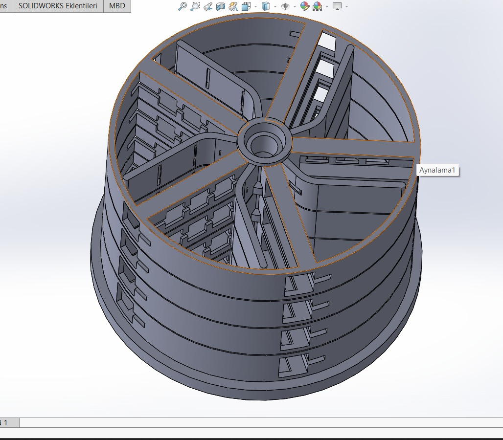 | 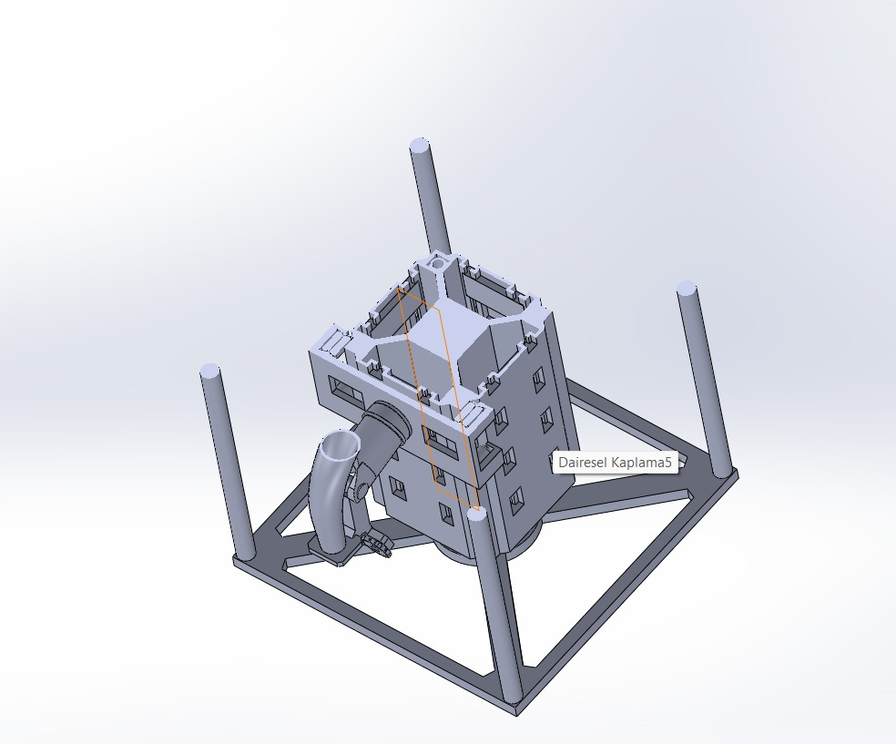 | 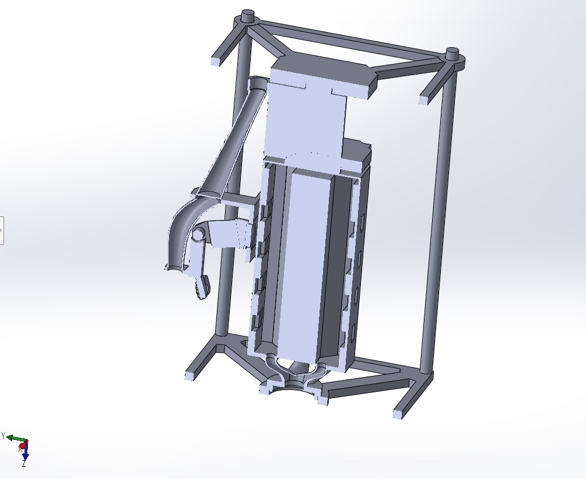 |
| 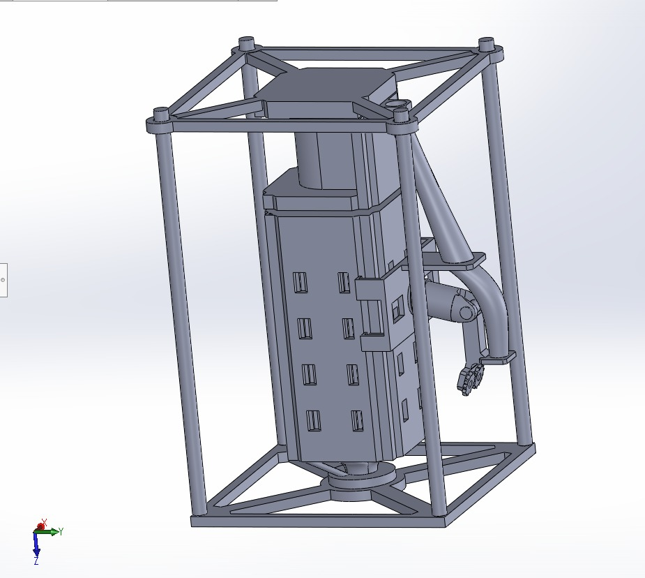 | 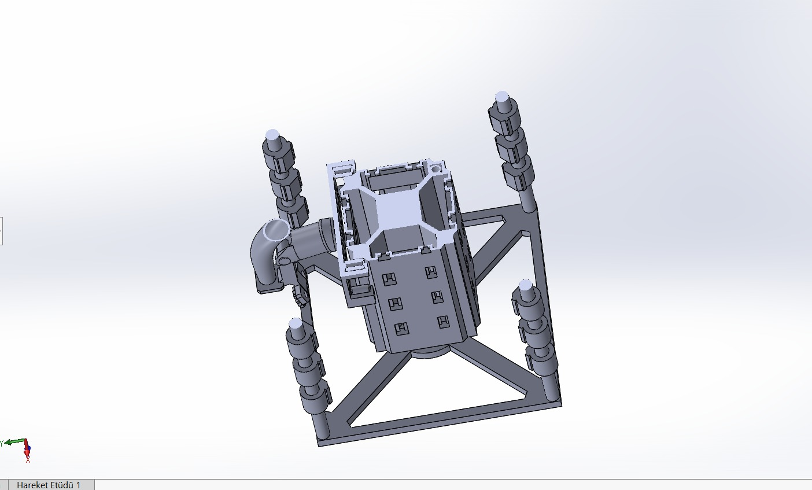 | 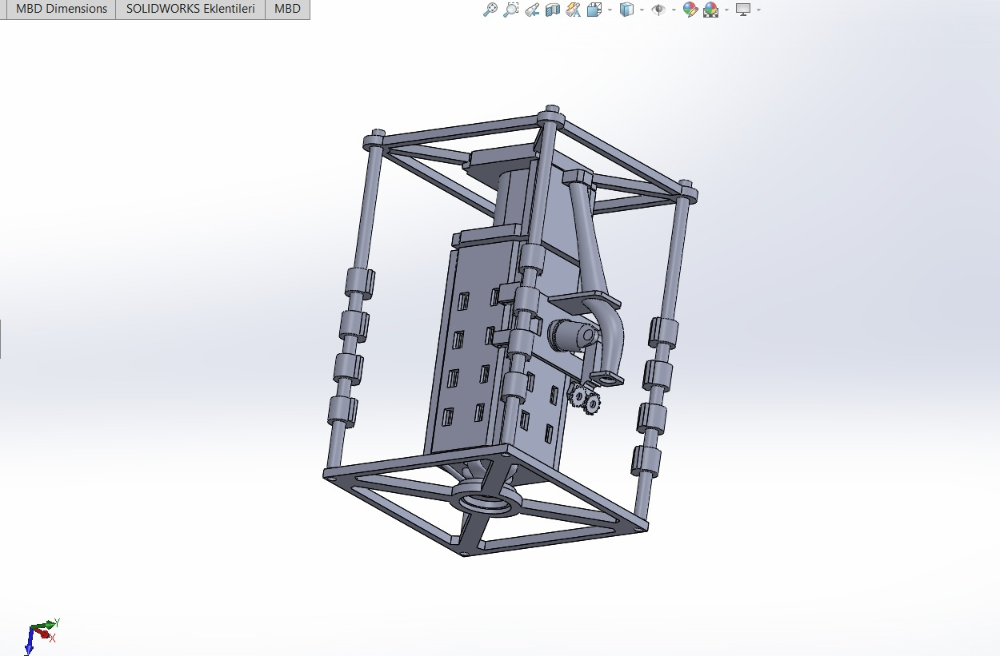 |
| 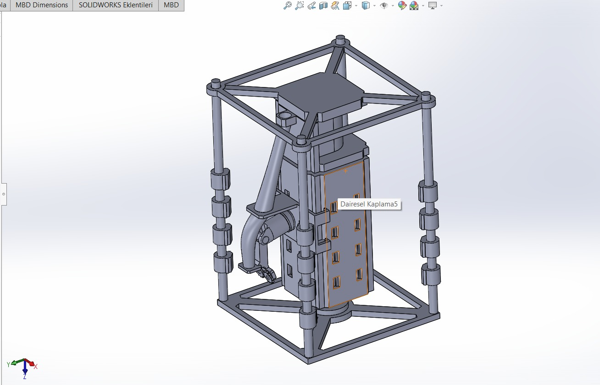 | | |

---

## 10. Kullanici Arayuzu Tasarimi

### 10.1 Renk Paleti

Nexus Tasarim Sistemi (Koyu Tema):

| Token | Aciklama | Hex Kodu | Kullanim |
|-------|----------|----------|----------|
| nexus-bg | Koyu Komur | #111318 | Ana arka plan |
| nexus-card | Koyu Gri | #1a1c23 | Kart arka plani |
| nexus-accent | Mavi | #5b8def | Vurgu, aktif oge |
| nexus-green | Yesil | #4ead5b | Basarili durum, nominal |
| nexus-orange | Turuncu | #d4903a | Uyari |
| nexus-red | Kirmizi | #d45555 | Kritik, hata |
| nexus-purple | Mor | #8b7fc7 | Besinler, ozel vurgu |
| nexus-border | Koyu Sinir | #2a2c35 | Kart sinirlari |
| nexus-text | Acik Gri | #c5c6cc | Ana metin |
| nexus-text-dim | Soluk Gri | #6c6e78 | Ikincil metin |

Genesis Alan Renkleri:

| Token | Hex Kodu | Kullanim |
|-------|----------|----------|
| genesis-leaf | #4ead5b | Bitki ve yaprak |
| genesis-water | #4a9caa | Su dongusu |
| genesis-soil | #8b6840 | Toprak ve substrat |
| genesis-o2 | #4ead5b | Oksijen |
| genesis-co2 | #d4903a | Karbondioksit |
| genesis-nutrient | #8b7fc7 | Besin maddeleri |

### 10.2 Tipografi

| Font | Agirliklar | Kullanim |
|------|-----------|----------|
| Inter | 300, 400, 500, 600, 700 | Ana metin, basliklar |
| JetBrains Mono | 400, 500, 600 | Sayilar, sensor degerleri, teknik veriler |

### 10.3 Animasyonlar

| Animasyon | Sure | Kullanim |
|-----------|------|----------|
| slide-in | 0.2 saniye | Oge girisi (sagdan sola) |
| fade-in | 0.3 saniye | Yumusak beliris |
| fade-in-up | 0.3 saniye | Asagidan yukari beliris |
| flow | 3 saniye (sonsuz dongu) | SVG su ve gaz akis cizgileri |
| fill-bar | 0.8 saniye | Ilerleme cubugu dolum animasyonu |
| slide-up | 0.3 saniye | Asagidan yukari kayma |

### 10.4 Durum Gosterimleri

Tum sistemde tutarli 3 seviyeli durum kodlamasi kullanilir:

| Durum | Renk | Anlam |
|-------|------|-------|
| nominal | Yesil | Her sey normal, mudahale gerekmiyor |
| warning | Turuncu | Dikkat gerekli, esik yaklastı |
| critical | Kirmizi | Acil mudahale gerekiyor |

---

## 11. Klavye Kisayollari

| Tus | Islem |
|-----|-------|
| 1 ila 8 | Sayfalarda hizli gezinme (1=Genel Bakis, 2=Buyume, 3=Beslenme, 4=Guc, 5=Gorev, 6=Tasarim, 7=Dijital Ikiz, 8=AI) |
| Space (Bosluk) | Simulasyonu duraklat veya devam ettir |
| + veya = | Hizi artir (1x, 5x, 10x, 50x sirasiyla) |
| - | Hizi azalt (50x, 10x, 5x, 1x sirasiyla) |
| B | Yan menuyu ac veya kapat |
| F | Tam ekran modu |
| ? | Kisayol yardim penceresini goster |
| Esc | Yardim penceresini kapat |

Not: Metin giris alanlarina yazarken kisayollar devre disi kalir.

---

## 12. Kurulum ve Calistirma

Gereksinimler: Node.js (v18 veya ustu) ve npm.

Bagimliliklari yuklemek icin: npm install
Gelistirme sunucusunu baslatmak icin (http://localhost:3000): npm run dev
Uretim derlemesi icin (cikti /build klasorune): npm run build
Uretim onizlemesi icin: npm run preview

Onemli notlar:
- Test veya linter yapilandirmasi bulunmamaktadir
- Vite dev sunucusu port 3000'de calisir ve tarayiciyi otomatik acar
- Uretim derlemesi build/ klasorune cikar
- Vercel uzerinde canli deploy mevcuttur

---

## 13. Dosya Yapisi

Kokdizin:
- index.html: HTML giris noktasi (Turkce dil etiketi)
- vite.config.js: Vite yapilandirmasi (port 3000)
- tailwind.config.cjs: Tailwind CSS + ozel nexus renkleri
- postcss.config.cjs: PostCSS yapilandirmasi
- package.json: Bagimliliklar ve komutlar
- CLAUDE.md: Claude AI tanım dosyasi
- KAYNAKCA.md: Bilimsel referanslar
- README.md: Proje aciklamasi

public/ klasoru:
- models/filizlendirme.glb: Cimlendirme sistemi 3D modeli
- models/Parca1.glb: Aeroponik kule parcasi 3D modeli
- screenshots/eski/: 7 adet ekran goruntusu
- tasarim/: 7 adet donanim tasarim fotografi
- textures/: 3D dokular

src/ klasoru - Ana kaynak kodlar:
- main.jsx: React giris noktasi
- App.jsx: Kok bilesen (Provider'lar, SplashScreen, OnboardingTour)
- index.css: Global stiller ve Tailwind direktifleri

src/context/:
- GenesisContext.jsx: Global state yonetimi (useReducer, 25'ten fazla aksiyon tipi)

src/hooks/:
- useSimulation.js: Ana simulasyon dongusu (saniyede 1 tick)
- useKeyboardShortcuts.js: Klavye kisayollari
- useNotificationWatcher.js: Toast bildirim tetikleyici

src/simulation/ - 15 simulasyon motoru:
- constants.js: Bilimsel sabitler veritabani (yaklasik 938 satir)
- plantGrowthModel.js: Sigmoid buyume modeli + cevre faktorleri
- resourceFlowEngine.js: O2/CO2/su/kalori dengeleri
- sensorSimulator.js: 180'den fazla sensor uretimi
- anomalyDetector.js: 4 katmanli anomali tespiti
- powerSystem.js: Gunes/nukleer guc yonetimi
- thermalSystem.js: Stefan-Boltzmann radyator modeli
- waterProcessing.js: 3 asamali su geri kazanimi
- degradationModel.js: 5 bilesen asinma modeli
- ndviModel.js: Bitki saglik indeksi
- pathogenModel.js: Hastalik yasam dongusu modeli
- radiationModel.js: GCR + SPE radyasyon
- missionPlanner.js: 3 fazli gorev takibi
- crewActivityModel.js: Murettebat metabolizmasi
- traceContaminants.js: ISS TCCS hava kalitesi

src/components/layout/:
- AppLayout.jsx: Ana cerceve (sidebar + topbar + icerik)
- Sidebar.jsx: Sol navigasyon (8 sayfa + veri aktarma)
- TopBar.jsx: Ust cubuk (zaman, hiz, saglik skoru)

src/components/overview/:
- OverviewPage.jsx: Ana gosterge paneli
- ClosedLoopDiagram.jsx: MELiSSA dongu SVG animasyonu
- HardwareDesignGallery.jsx: 3D model goruntuleyici

src/components/growth/:
- GrowthMonitorPage.jsx: Bitki buyume izleme
- NDVIHeatmap.jsx: NDVI isi haritasi

src/components/ diger sayfalar:
- nutrition/NutritionPage.jsx: Beslenme analizi
- power/PowerPage.jsx: Guc ve enerji yonetimi
- mission/MissionPage.jsx: Gorev planlama ve zaman cizelgesi
- digital-twin/DigitalTwinPage.jsx: 3D dijital ikiz
- farm-view/FarmViewPage.jsx: Tesis haritasi ve zon detaylari
- ai/AIPredictionPage.jsx: Yapay zeka tahmini
- design/DesignPage.jsx: 3D CAD goruntuleyici
- links/LinksPage.jsx: Dis baglanti sayfasi

src/components/ui/ - 11 paylasilan bilesen:
- SplashScreen.jsx, OnboardingTour.jsx, ErrorBoundary.jsx, EventLog.jsx, WhatsHappening.jsx, ToastNotification.jsx, GaugeCircle.jsx, StatCard.jsx, StatusDot.jsx, InfoTooltip.jsx, KeyboardHelp.jsx

src/utils/:
- formatters.js: Veri formatlama yardimcilari
- exportData.js: Veri disari aktarma

---

## 14. Bagimliliklar

Uretim bagimliliklari:

| Paket | Surum | Amac |
|-------|-------|------|
| react | 19.2.4 | UI framework |
| react-dom | 19.2.4 | DOM render |
| three | 0.183.2 | 3D grafik kutuphanesi |
| @react-three/fiber | 9.5.0 | Three.js icin React renderer |
| @react-three/drei | 10.7.7 | 3D yardimci bilesenler (OrbitControls, Stage vb.) |
| recharts | 3.8.0 | Grafik kutuphanesi (alan, cizgi, pasta, cubuk grafikleri) |
| react-icons | 5.6.0 | Ikon kutuphanesi (Feather Icons, Font Awesome 6) |

Gelistirme bagimliliklari:

| Paket | Surum | Amac |
|-------|-------|------|
| vite | 8.0.2 | Build araci ve gelistirme sunucusu |
| @vitejs/plugin-react | 6.0.1 | React Fast Refresh |
| tailwindcss | 3.4.19 | CSS framework |
| postcss | 8.5.8 | CSS donusumu |
| autoprefixer | 10.4.27 | CSS vendor onekleri |

---

## 15. Bilimsel Referanslar

| Kaynak | Kullanim Alani |
|--------|----------------|
| ESA MELiSSA | Kapali dongu yasam destek mimarisi, 4 kompartiman tasarimi |
| NASA BVAD Rev2 | Murettebat metabolik verileri (O2, CO2, su, kalori, atik) |
| NASA VEGGIE/APH | Bitki buyume verileri, ISS deneyleri, marul ve bugday referanslari |
| BIOS-3 (Rusya) | Kapali ekolojik sistem deneyimi |
| Yuegong-1 (Cin) | Su geri kazanim oranlari, cok asamali isleme verileri |
| Eden ISS (ESA/DLR) | Antarktika sera verileri, NDVI referanslari |
| NASA CELSS | Bitki verimi referans degerleri (g/m2/gun) |
| ISS TCCS | Iz kirletici kontrol sistemi, SMAC-180 limitleri |
| Stefan-Boltzmann Kanunu | Termal radyator modeli |
| Weibull Dagilimi | Bilesen guvenilirlik modeli |
| Shannon Cesitlilik Indeksi | Biyocesitlilik skoru hesaplamasi |
| Hoagland Cozeltisi | Aeroponik besin recetesi (N, P, K konsantrasyonlari) |

---

## Sonuc

GENESIS, 15 bilimsel simulasyon motoru, 180'den fazla sanal sensor, 8 interaktif sayfa, 3D dijital ikiz ve yapay zeka analizi ile uzun sureli uzay gorevleri icin kapsamli bir yasam destek sistemi simulatorudur. Tum hesaplamalar gercek uzay programlarinin bilimsel verilerine dayanmaktadir ve tamamen Turkce arayuz ile sunulmaktadir.

Toplam: 50'den fazla kaynak dosya, yaklasik 5000 satir simulasyon kodu, yaklasik 8000 satir React bilesen kodu.
